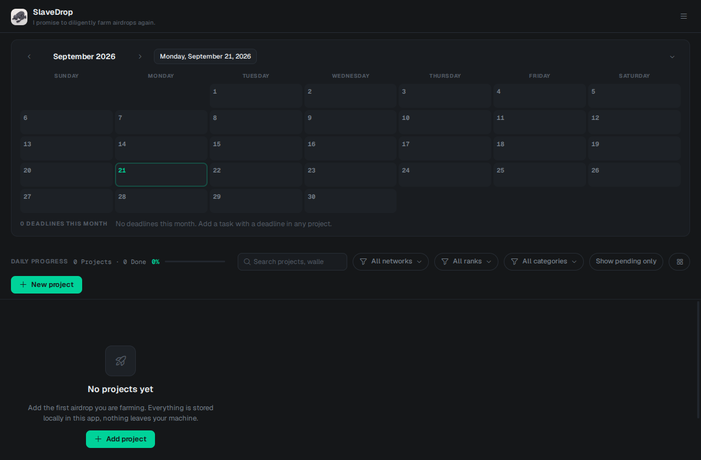

<div align="center">


# SlaveDrop

**Local-first airdrop farming tracker.** Everything is stored on your machine — nothing leaves it.

[Download for your platform](#-install) · [Build from source](#-build-from-source) · [Features](#-features) · [Screenshots](#-screenshots)

</div>

---

**SlaveDrop** is a small desktop app that keeps track of the airdrops you farm every day: which projects you're working on, their ranks, statuses, deadlines, the wallets and accounts you use for each, and your daily progress. No accounts, no servers, no telemetry — just a single SQLite database on your computer.

## ✦ Install

Prebuilt installers are published on the [Releases](https://github.com/brodewa369/slavedrop/releases) page. Download the file for your OS and run it.

| Platform | File | Notes |
|---|---|---|
| **Windows** | `SlaveDrop-1.0.0-win-x64.exe` | Standard installer (NSIS) — pick the folder, gets a desktop shortcut |
| **Linux** | `SlaveDrop-1.0.0-linux-x86_64.AppImage` | Make it executable (`chmod +x`) and run. No installation needed |
| **Linux** | `SlaveDrop-1.0.0-linux-amd64.deb` | For Debian/Ubuntu — install with `sudo dpkg -i` |
| **macOS** | `SlaveDrop-1.0.0-mac.dmg` | Drag into Applications |

**Linux AppImage, first run:**

```bash
chmod +x SlaveDrop-1.0.0-linux-x86_64.AppImage
./SlaveDrop-1.0.0-linux-x86_64.AppImage
```

If your distro blocks AppImages, install the `.deb` instead, or run the AppImage through [AppImageLauncher](https://github.com/TheAssassin/AppImageLauncher).

Your data lives at:

- Linux: `~/.config/slavedrop/slavedrop.db`
- Windows: `%APPDATA%\slavedrop\slavedrop.db`
- macOS: `~/Library/Application Support/slavedrop/slavedrop.db`

## ✦ Build from source

Needs [Node.js](https://nodejs.org) 18+ and Git.

```bash
git clone https://github.com/brodewa369/slavedrop.git
cd slavedrop
npm install         # installs Electron + dependencies
npm start           # run the app
```

Package an installer for your own OS:

```bash
npm run dist        # builds for the current OS
```

Cross-building from one OS to another is not supported by Electron — run the build on the target OS (or use a VM / CI) if you need a specific platform's installer.

## ✦ Features

**Projects**
- Name, website, main X account, category, note, and a custom icon image
- Rank S/A/B/C/D — your own priority, cards sort by it
- Status: Ongoing, TGE, Completed, Eligible, Ineligible (extendable)
- Cost: Free, or any custom amount
- Chains: multi-select — one project can cover many
- Platform: X, Desktop, App, Extension (extendable)
- Wallet app: which wallet you farm with (extendable)

**Tasks & progress**
- Per-task checkboxes with optional deadlines and links
- Fully-checked projects count as done even if the flag was never set
- Two progress bars: global (toolbar) and per project (detail panel + card footer)
- Monthly calendar marks every deadline

**Extras per project**
- Additional links, wallets (with labels), X accounts, emails — unlimited
- Category chips are multi-select; network is single; both accept new values typed inline

**Everything else**
- Search across everything (name, note, wallet, email, X, task text, links)
- Filters by network, category, rank — all with live counts
- Backup and restore the database (native file dialogs)
- Open websites / X / links in the system browser; copy wallets, accounts, emails
- Daily checkmark per project, with an indeterminate state for partial tasks

## ✦ Themes

SlaveDrop ships with four interface skins and several backgrounds:

- **Default** — clean neutral, single accent
- **Paper Ledger** — sepia, book-like
- **Liquid Aurora** — translucent frosted-glass panels over a color gradient. Four preset gradients (Aurora, Nebula, Ember, Forest) or your own custom image
- **Terminal CRT** — monospace green-on-black

Dark/light mode is separate from the skin. Everything is switchable live from the menu (top-right).

## ✦ Screenshots

<div align="center">

</div>

## ✦ Tech stack

- **Electron** + **better-sqlite3** (synchronous — no async gymnastics)
- Vanilla JS renderer, no framework
- Self-hosted fonts: Geist, Geist Mono, Inter, JetBrains Mono, Plex Mono, Newsreader
- [Phosphor Icons](https://phosphoricons.com)

## ✦ Privacy

There is no backend. The app opens no network connections on its own. "Open website / X" hands the URL to your system browser, that's it. The database is a plain file you can back up, copy, or delete.

## ✦ License

MIT — see [LICENSE](LICENSE).
