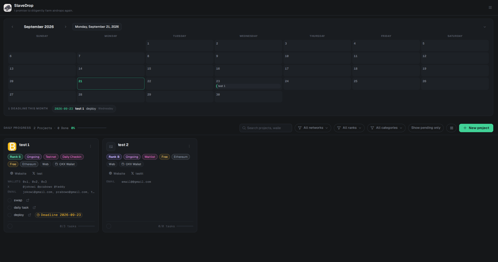
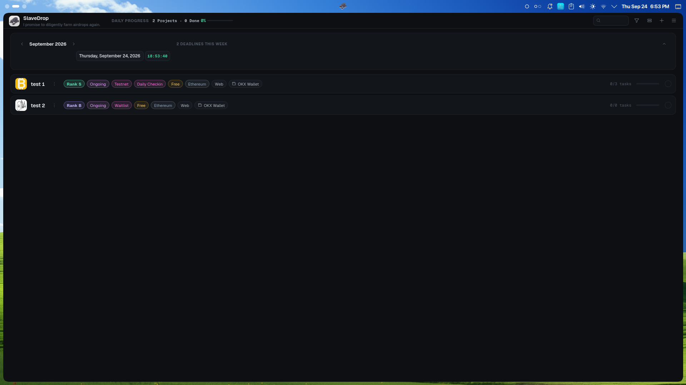
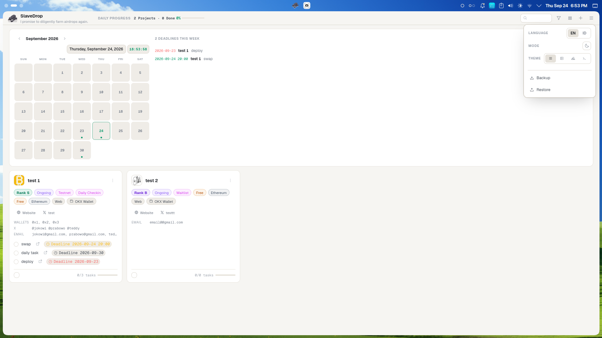
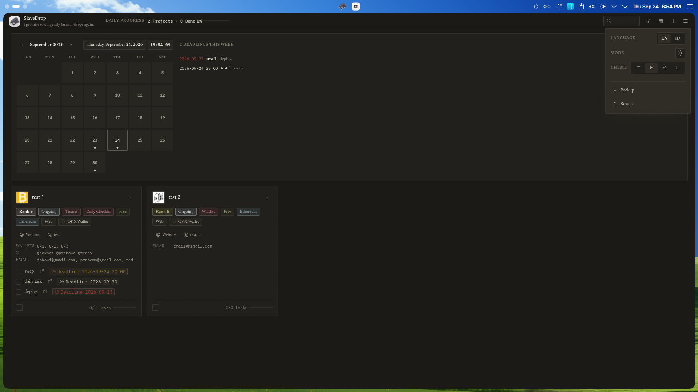
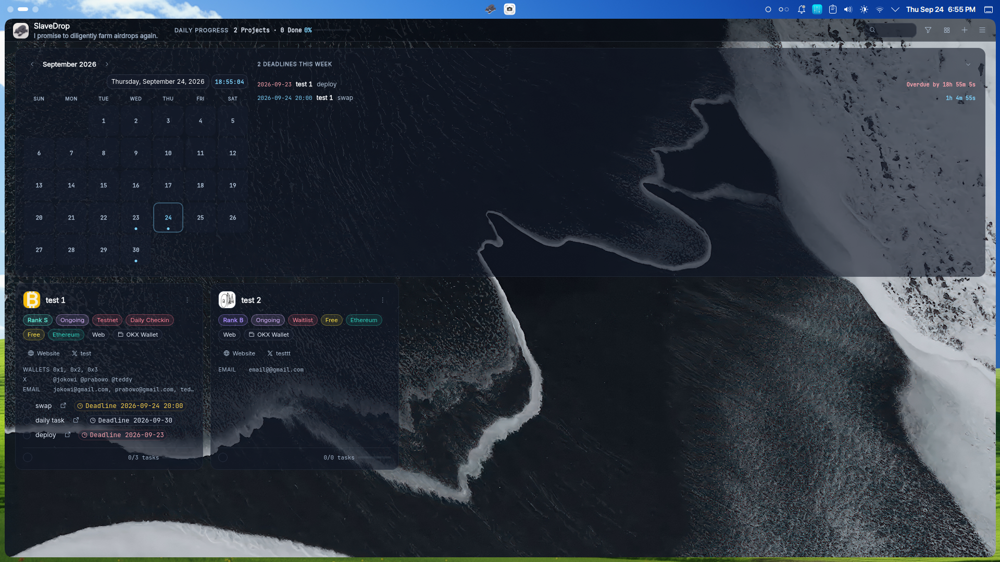
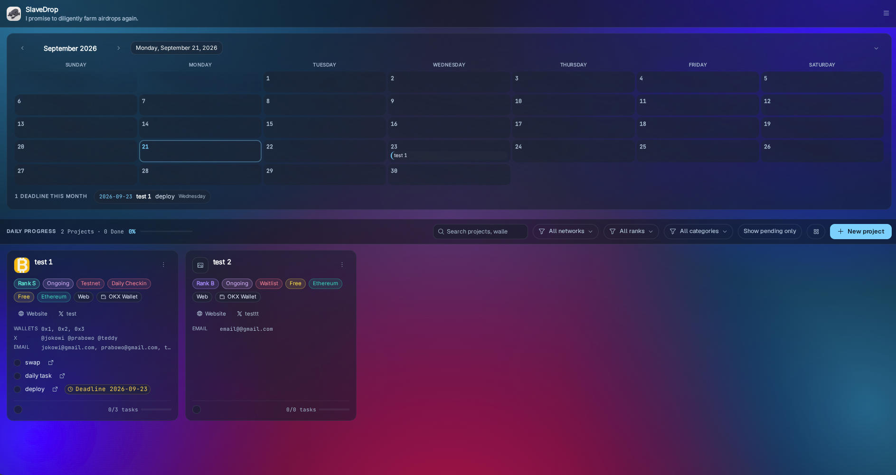
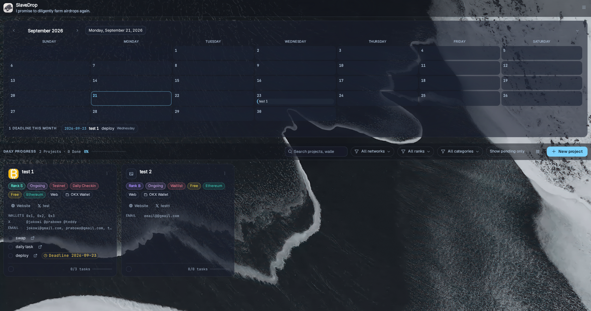
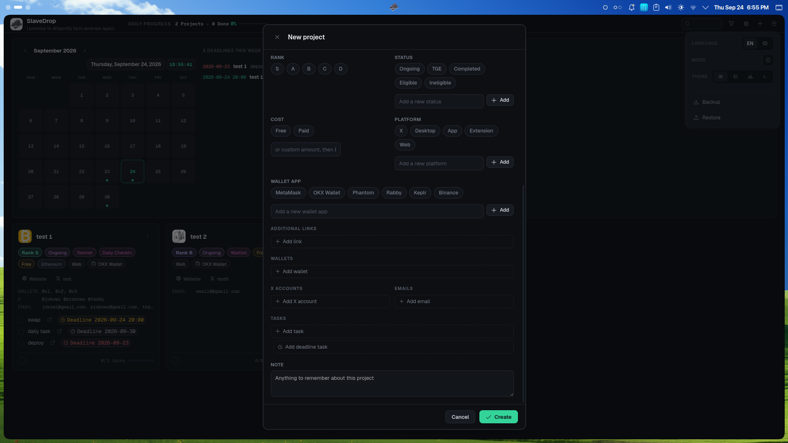

<div align="center">


# SlaveDrop

**Local-first airdrop farming tracker.** Everything is stored on your machine — nothing leaves it.

[Install](#-install) · [Features](#-features) · [Screenshots](#-screenshots) · [Android](./mobile/) · [Build](#-build-from-source) · [Your data](#-your-data) · [Support the project](#-support-the-project)

</div>

---

**SlaveDrop** is a desktop app for airdrop farmers. It tracks every project you're farming — ranks, statuses, deadlines, the wallets and accounts you use for each, and your daily progress — in one place, on your own computer. No accounts, no servers, no telemetry. Just a single SQLite file you fully control.

> **v2 — now built with [Tauri](https://tauri.app).** Same UI, same data format, same zero-network guarantee, but the Electron runtime is gone: the app is one ~7 MB Rust binary using the system webview. The previous Electron implementation is preserved on the [`electron` branch](../../tree/electron).

> **📲 Android** — the mobile build ships in this repo too: source in [`mobile/`](./mobile/), [📱 download the Android release](../../releases/tag/android-v1.0.0) (v1.0.0) or grab the APKs in [`mobile/releases/`](./mobile/releases/) — `debug` for daily testing, `release` for normal use (same signing key, so one upgrades the other without losing data). Desktop targets Linux, macOS and Windows via Tauri; Android 5.0+ via a WebView shell.

## ✦ Screenshots



<table>
<tr>
<td></td>
<td></td>
</tr>
<tr>
<td></td>
<td></td>
</tr>
<tr>
<td></td>
<td></td>
</tr>
</table>



## ✦ Why SlaveDrop

- **One dashboard for every farm.** Every project, its rank, status, chains, wallets, and tasks — in one window instead of scattered across tabs and notes.
- **Never miss a deadline.** A monthly calendar marks every task deadline across all projects, with a "this month" list that highlights what's overdue.
- **Know your daily output.** The daily progress strip tells you exactly how many projects you've fully completed today — driven by per-task checkboxes, not a manual toggle.
- **Your data is yours.** No signup, no login, no cloud sync, no analytics. The database is a plain file at a known path — back it up, copy it, delete it, it's yours.
- **Works offline.** Nothing phones home. The only network access is when you click a link, and that's handed to your own browser.
- **Lightweight.** The v2 Tauri build is a single small binary with the system webview — no bundled Chromium, quick cold start, low idle RAM.

## ✦ Install

Prebuilt packages live on the [Releases page](../../releases).

### Linux — AppImage (any distro: Arch, Debian, Ubuntu, Fedora, openSUSE…)

1. Download `SlaveDrop_2.0.0_amd64.AppImage` from [Releases](../../releases).
2. Make it executable and run it:

```bash
chmod +x SlaveDrop_2.0.0_amd64.AppImage
./SlaveDrop_2.0.0_amd64.AppImage
```

The AppImage bundles the webview and its libraries, so it runs on virtually any modern glibc distro **without installing extra packages**. If your system has no FUSE (some minimal/container setups), run it with extraction mode instead:

```bash
APPIMAGE_EXTRACT_AND_RUN=1 ./SlaveDrop_2.0.0_amd64.AppImage
```

### Debian / Ubuntu — .deb

```bash
sudo apt install ./SlaveDrop_2.0.0_amd64.deb
```

(or `sudo dpkg -i ./SlaveDrop_2.0.0_amd64.deb && sudo apt -f install`)

### Arch / CachyOS / Manjaro

The AppImage above works out of the box. To install the runtime via pacman instead (for source builds):

```bash
sudo pacman -S webkit2gtk-4.1 gst-plugins-good gst-plugin-glsink
```

### Fedora / RHEL

The AppImage works as-is. For source builds the webview stack is:

```bash
sudo dnf install webkit2gtk4.1 gtk3
```

### First launch

Your database is created at `~/.local/share/com.brodewa.slavedrop/airdrop.db`. If you're upgrading from the old Electron version, first launch migrates your data automatically (see [Migrating from Electron](#-migrating-from-electron)).

## ✦ Build from source

Needs [Git](https://git-scm.com), [Rust](https://rustup.rs) (stable), [Node.js](https://nodejs.org) (for the Tauri CLI), and the Linux webview stack (see per-distro packages in [Install](#-install)).

```bash
git clone https://github.com/brodewa369/slavedrop.git
cd slavedrop

# install the Tauri CLI once
npm install -g @tauri-apps/cli

# release build + installers (what Releases ships)
npx tauri build --bundles appimage     # -> src-tauri/target/release/bundle/appimage/*.AppImage
npx tauri build --bundles deb          # -> .deb  (needs dpkg)

# or plain binary for manual install
cargo build --release    # -> src-tauri/target/release/slavedrop
```

**Manual install on Linux (XDG desktops)** — binary + app-menu entry:

```bash
install -Dm755 src-tauri/target/release/slavedrop ~/.local/bin/slavedrop
install -Dm644 src-tauri/icons/32x32.png   ~/.local/share/icons/hicolor/32x32/apps/slivedrop.png
install -Dm644 src-tauri/icons/128x128.png ~/.local/share/icons/hicolor/128x128/apps/slivedrop.png
install -Dm644 src-tauri/icons/icon.png    ~/.local/share/icons/hicolor/512x512/apps/slivedrop.png

cat > ~/.local/share/applications/com.brodewa.slivedrop.desktop <<EOF
[Desktop Entry]
Type=Application
Name=SlaveDrop
Comment=Minimalist local airdrop farming tracker — your data never leaves your machine
Exec=$HOME/.local/bin/slivedrop
Icon=slivedrop
Terminal=false
Categories=Utility;
StartupWMClass=slivedrop
StartupNotify=true
EOF

update-desktop-database ~/.local/share/applications
```

**Dev mode:** `./run.sh` (or `npx tauri dev`) — hot-reload development build.

## ✦ Build on Windows & macOS

No prebuilt Windows/macOS binaries are published — the maintainer only runs Linux — but building yourself is standard Tauri:

1. Install the [Tauri v2 prerequisites](https://tauri.app/start/prerequisites/) for your OS:
   - **Windows:** Rust (MSVC toolchain), WebView2 (preinstalled on Win 10/11), Node.js.
   - **macOS:** Rust, Xcode command-line tools, Node.js.
2. Then:

```bash
git clone https://github.com/brodewa369/slivedrop.git
cd slivedrop
npm install -g @tauri-apps/cli

npx tauri build --bundles msi      # Windows installer (or: nsis)
npx tauri build --bundles dmg      # macOS disk image
```

The installers land in `src-tauri/target/release/bundle/`. The default `tauri.conf.json` targets Linux packages only, so always pass `--bundles` explicitly on Windows/macOS as shown above.

## ✦ Your data

- Linux: `~/.local/share/com.brodewa.slivedrop/airdrop.db`
- One plain SQLite file. Back it up, copy it, delete it — it's yours.
- Nothing in the app opens a network connection except handing link clicks to your browser.

## ✦ Migrating from Electron

On first launch, if the Tauri database is empty and the old Electron database exists (`~/.config/slavedrop/airdrop.db`), every project, task, and setting is migrated automatically. Install the Tauri build, run it once, verify your data, then remove the Electron app.

## ✦ Platform notes

- **Linux (Wayland):** window decorations are provided by your compositor. A small vendored patch of [`tao`](vendor/tao) skips tao's fallback client-side headerbar when decorations are enabled, so the app gets the same native titlebar as every other window (KWin, Sway, …). X11, Windows, and macOS use stock `tao`.
- **Tech stack:** Rust + Tauri v2 + vanilla JS/HTML/CSS UI + SQLite. No framework runtime, no bundled browser.

## ✦ Support the project

SlaveDrop is free and open source. If it saves you some hours of spreadsheet maintenance, a tip is very appreciated:

| Network | Address |
|---|---|
| **EVM** (ETH / BSC / Base / Arbitrum / Optimism / etc.) | `0xbef378f1260c3155143418484e2c7375372547ee` |
| **Solana** | `5o1HKKZCvTXfYfT3qqC3k6kyFk4tUzSh4ygd1M2tE97F` |
| **Tron (TRX)** | `TD7tGEvGveHf3jhZXGzxKkAaPHsEWXYPv9` |
| **Bitcoin (Taproot)** | `bc1p6a0zty9plsxstrryd4e9903fjd7r73g3qckwnfykdku9nptgsslsnksukc` |

Star the repo if you use it — it helps other farmers find it.

## ✦ License

[MIT](LICENSE) © brodewa
