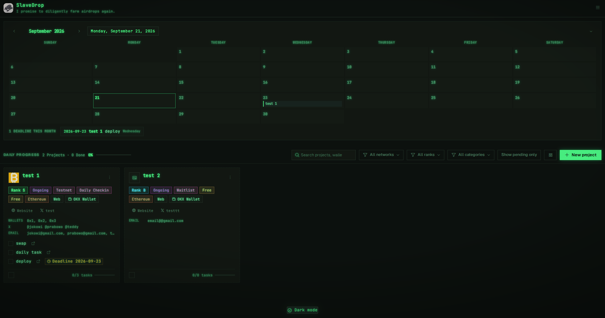

<div align="center">


# SlaveDrop

**Local-first airdrop farming tracker.** Everything is stored on your machine — nothing leaves it.

[Download](#-install) · [Build from source](#-build-from-source) · [Features](#-features) · [Screenshots](#-screenshots) · [Support](#-support-the-project)

</div>

---

**SlaveDrop** is a desktop app for airdrop farmers. It tracks every project you're farming — ranks, statuses, deadlines, the wallets and accounts you use for each, and your daily progress — in one place, on your own computer. No accounts, no servers, no telemetry. Just a single SQLite file you fully control.

If you farm more than one airdrop, you already know the mess: spreadsheets that go stale, bookmarks that say nothing, and no idea what's due today. SlaveDrop fixes that.

## ✦ Why SlaveDrop

- **One dashboard for every farm.** Every project, its rank, status, chains, wallets, and tasks — in one window instead of scattered across tabs and notes.
- **Never miss a deadline.** A monthly calendar marks every task deadline across all projects, with a "this month" list that highlights what's overdue.
- **Know your daily output.** The daily progress strip tells you exactly how many projects you've fully completed today — driven by per-task checkboxes, not a manual toggle.
- **Your data is yours.** No signup, no login, no cloud sync, no analytics. The database is a plain file at a known path — back it up, copy it, delete it, it's yours.
- **Works offline.** Nothing phones home. The only network access is when you click a link, and that's handed to your own browser.
- **Not another webapp.** A real desktop app, one click away, with real keyboard-navigable UI and native file dialogs.

## ✦ Install

Prebuilt installers are on the [Releases](https://github.com/brodewa369/slavedrop/releases) page.

| Platform | File | How to install |
|---|---|---|
| **Linux** | `SlaveDrop-1.0.0-linux-x86_64.AppImage` | `chmod +x` and run — no installation needed |
| **Linux** | `SlaveDrop-1.0.0-linux-amd64.deb` | `sudo dpkg -i SlaveDrop-1.0.0-linux-amd64.deb` |

**AppImage, first run:**

```bash
chmod +x SlaveDrop-1.0.0-linux-x86_64.AppImage
./SlaveDrop-1.0.0-linux-x86_64.AppImage
```

If your distro blocks AppImages, use the `.deb` instead (or run it through [AppImageLauncher](https://github.com/TheAssassin/AppImageLauncher)).

**Windows and macOS** — sorry, no prebuilt builds. The maintainer only runs Linux, so those installers aren't produced here. **Building from source takes about two minutes** — just `git clone`, `npm install`, `npm start`. See [Build from source](#-build-from-source).

Your data lives at:

- Linux: `~/.config/slavedrop/slavedrop.db`
- Windows: `%APPDATA%\slavedrop\slavedrop.db`
- macOS: `~/Library/Application Support/slavedrop/slavedrop.db`

## ✦ Build from source

Needs [Node.js](https://nodejs.org) 18+ and Git.

```bash
git clone https://github.com/brodewa369/slavedrop.git
cd slavedrop
npm install
npm start
```

That's it — the app opens.

## ✦ Features

**Projects**
- Name, website, main X account, category, note, and a **custom icon image** per project
- **Rank S/A/B/C/D** — your own priority ranking; project cards sort by it
- Status per project: Ongoing, TGE, Completed, Eligible, Ineligible (extendable — type your own)
- Cost tracking: pick **Free**, or type any custom amount
- **Multi-chain support** — one project can cover many chains
- Platform: X, Desktop, App, Extension (extendable)
- Wallet app: which wallet you farm each project with (extendable)

**Tasks & deadlines**
- Per-task checkboxes with optional deadlines and per-task links
- **Fully-checked projects count as done** even if the done flag was never set — no double bookkeeping
- Two progress bars: global (toolbar, all projects) and per project (detail panel + card footer)
- **Monthly calendar** marking every deadline across all projects
- "Deadlines this month" list with overdue highlighting

**Identities per project**
- Unlimited: additional links, **wallets with labels**, X accounts, emails
- One-click **copy to clipboard** for any wallet, account, or email
- Open any website, X profile, or link in your system browser

**Finding things**
- **Global search** across name, note, wallet, email, X account, task text, and links
- Filters by network, category, and rank — all with live counts
- Daily checkmark per project, with an **indeterminate state** when only some tasks are done

**Data safety**
- **Backup and restore** the whole database via native file dialogs
- Everything stored in one SQLite file at a known, documented path
- Category and network chips are editable — add new values inline, they become permanent

## ✦ Themes

Four interface skins, switchable live from the menu:

- **Default** — clean neutral with a single accent color
- **Paper Ledger** — warm sepia, book-like, for the ledger keepers
- **Liquid Aurora** — translucent frosted-glass panels over a color gradient. Four preset gradients (Aurora, Nebula, Ember, Forest), or **use your own image as the background**
- **Terminal CRT** — monospace green-on-black for the degens

Dark and light mode are separate from the skin — mix and match.

## ✦ Screenshots

<div align="center">


<br><br>


<br><br>


<br><br>


<br><br>


<br><br>


<br><br>


<br><br>


<br><br>



</div>

## ✦ Tech stack

- **Electron** + **better-sqlite3** (synchronous — no async gymnastics)
- Vanilla JS renderer, no framework, no build step
- Self-hosted fonts: Geist, Geist Mono, Inter, JetBrains Mono, Plex Mono, Newsreader
- [Phosphor Icons](https://phosphoricons.com)

## ✦ Privacy

There is no backend. The app makes no network requests on its own. Clicking a website or X link hands the URL to your system browser — that's the only time anything leaves the app. The database is a plain SQLite file. Nothing is collected, uploaded, or analyzed.

## ✦ Support the project

SlaveDrop is free and open source. If it saves you some hours of spreadsheet maintenance, a tip is very appreciated:

| Network | Address |
|---|---|
| **EVM** (ETH / BSC / Base / Arbitrum / Optimism / etc.) | `0xbef378f1260c3155143418484e2c7375372547ee` |
| **Solana** | `5o1HKKZCvTXfYfT3qqC3k6kyFk4tUzSh4ygd1M2tE97F` |
| **Tron (TRX)** | `TD7tGEvGveHf3jhZXGzxKkAaPHsEWXYPv9` |
| **Bitcoin (Taproot)** | `bc1p6a0zty9plsxstrryd4e9903fjd7r73g3qckwnfykdku9nptgsslsnksukc` |

Star the repo if you use it — it helps other farmers find it.

## ✦ License

MIT — see [LICENSE](LICENSE).
